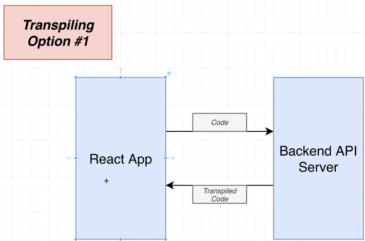
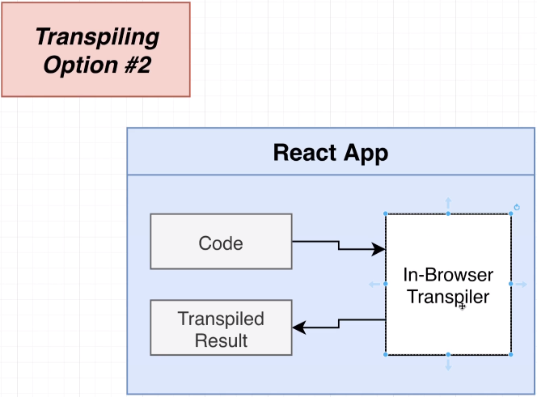
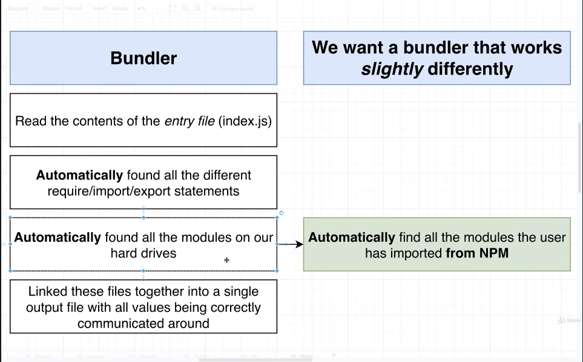
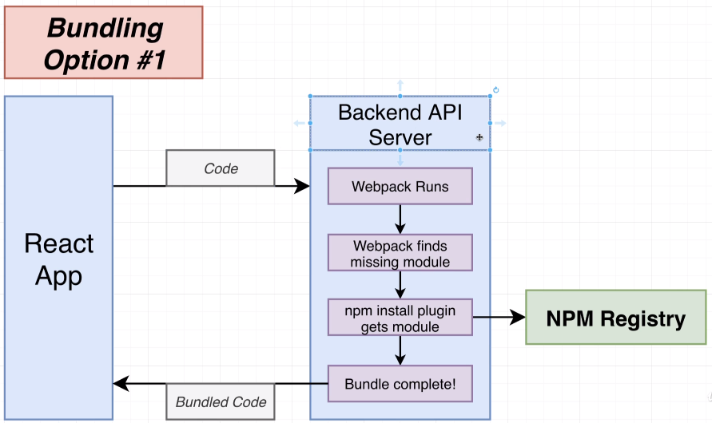
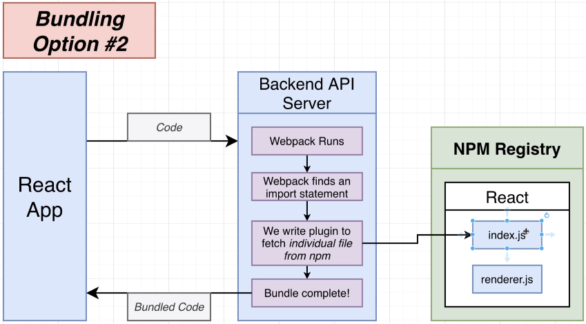
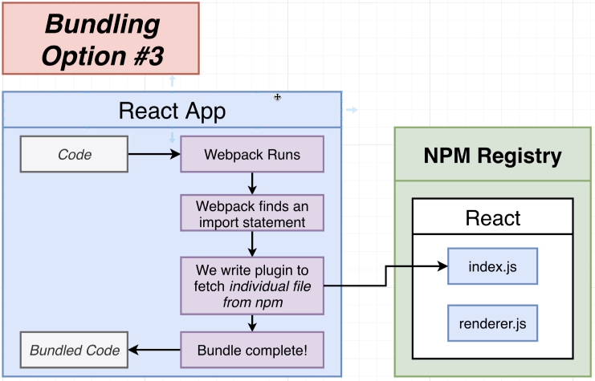
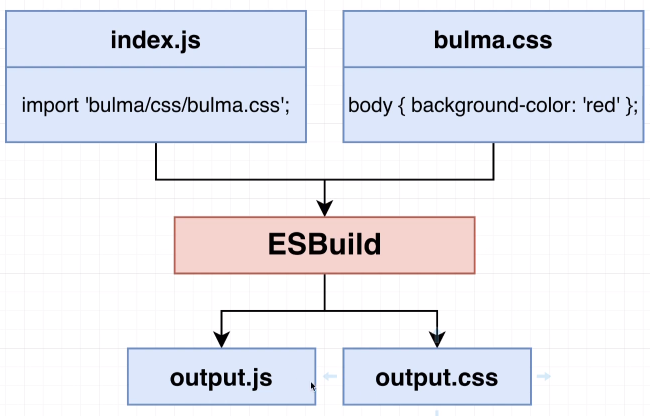
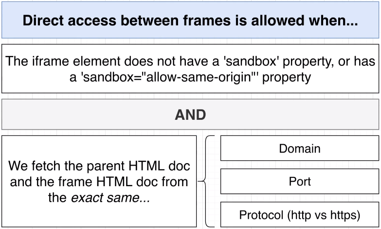
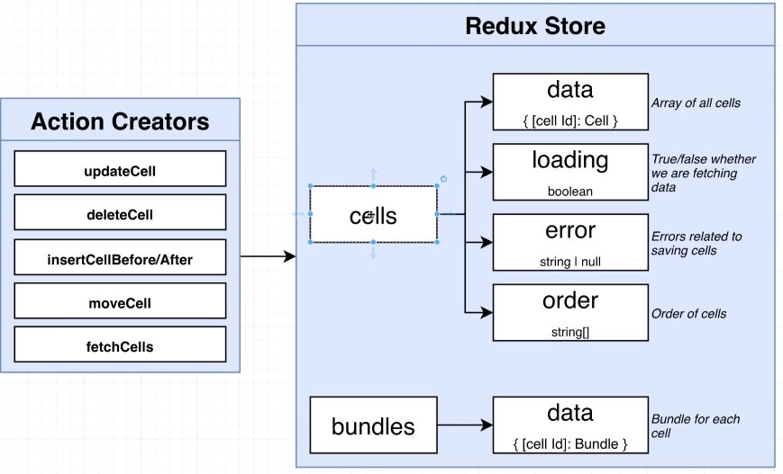

# JavaScript Notebook: React with TypeScript

Building a javascript notebook (think Jupyter notebook) with React and TypeScript

## Our App

1. We want to run something like 'jbook serve'
1. This should start a server on localhost:4005
1. User will write code into an editor
   - js or md in a cell
1. We bundle in the browser
1. We execute the users code in an iframe

## Inpsired By

1. codepen.io
1. babeljs.io
1. Jupyter

## Transpiling Java Code

The above sites use live transpiling of code. How do we do that in this app?

1. Backend API Server
   
1. In-Browser Transpiler
   - In React App
     

From our inspirations above..

1. codepen
   - Uses a backend server to transpile code
   - Running babel
   - Sends js as string in request
   - Gets transpiled js back in response
   - API Server
1. babeljs
   - Uses remote transpiling
   - 'In-Browser' Transpiler
   - In React App

## Javascript Modules

A JS file that makes some values available to other files and/or consumes values from other files

Why do we care besides using them in the app?

Our app will allow a user to import js and css files into a code cell

### JS Module Systems

1. AMD
   ```js
   define(['dep'], (dep) => {});
   ```
1. common js
   ```js
   require();
   module.exports;
   ```
1. ES Modules
   ```js
   import a from 'a';
   export default 123;
   ```

- Transpiliers will sometimes take one version and convert to another!
- A bundler (webpack) will take all the individual files and combine into a single file

## Bundling JS Code



### Options

1. Backend API Server
   - [NPM Install Plugin](https://webpack.js.org/plugins/npm-install-webpack-plugin/)
   - Weakness is api server will save a ton of dependencies locally
     
1. Backend API Server with Custom plugin
   - Makes request to npm registry
   - Bundle code instead of save dependency
     
1. Do everything inside the React app
   - Instead of API Server
     

## Our Application Approach

We are doing the local, 'in-app', 'in-browser' approach

1. Significantly faster than server approach
1. Big issue, webpack doesn't work in the browser
1. Instead of using webpack and babel (work great locally)
   - We are going to use [ESBuild](https://github.com/evanw/esbuild)
1. ESBuild can transpile + bundle all in the browser
   - Much faster than webpack (much)

### Transpiler


1. ESBuild works out of the box for transpiling
   - 'transform' call

### Bundler


1. Not using webpack
1. Using [ESBuild](https://github.com/evanw/esbuild)
1. ESBuild usually looks on the local filesystem for files to bundle

- Running in the browser...we don't have a local filesystem
- Instead we are pointing ESBuild at a url where the file exists
- NPM registry will be the url...kind of

1. NPM by itself won't work
   - We will use a service called Unpkg
   - NPM registry is configured to block any request not at a specific url
   - Throws CORS error
1. [UNPKG](https://unpkg.com/)
   - Global content delivery network for everything on NPM
1. So, for ESBuild to work, bundling on the web...we have to define our own version of it's build step (where the bundling occurs)
   ```js
   const result = await ref.current.build({
   	entryPoints: ['index.js'],
   	bundle: true,
   	write: false,
   	plugins: [unpkgPathPlugin()],
   });
   ```
   - Define a 'plugin' and override functions that default ESBuild would use
   - 'onResolve' and 'onLoad': Work together
   - 'onResolve' returns an object that is fed to 'onLoad'
   - filter args for onResolve and filter, namespace args are key

## Cache Layer

We send lots of requests to unpkg, especially if an includes has a lot of it's own includes

We are going to develop a caching layer to store some of these files to limit the number of requests

1. [localforage](https://www.npmjs.com/package/localforage)
   - API over the browser's indexedDB
   - kvp with the path as the key and the loaded package as the value

## Loading css Files

1. Need to have a css loader
1. Issue w/ esbuild on the web
   - When building css and js, it'll generate 2 files
     - But we don't have a local file system
   - It only outputs js on the web, so we need a way to include unpackaged css into jss



1. Instead, we will write js to take the content of the css and put it in the head tag
   - Something of a hack

## Code Execution

### Considerations

These are all big issues we have to solve

1. User-provided code might throw errors and cause our program to crash
   ```js
   console.loooog('Error');
   ```
1. User-provided code might mutate the DOM, causing our program to crash
   ```js
   document.body.innerHTML = '';
   ```
1. A user might accidentally run code provided by another malicious user
1. Infinite loops (or really big loops)
   - Future work to fix

What's the solution? **IFrames**

### IFrames

1. Used to embed one element (html element) inside another
   ```html
   <iframe src="/test.html" title="test"></iframe>
   ```
1. Allows you to run js in separate contexts
   - Separate execution contexts
1. You can connect the parent and child contexts to share info
   - In child element, reference 'parent'
   - In parent, reference:
   ```js
   document.querySelector('iframe').contentWindow;
   ```
1. You can also dissalow communication b/t the two
   
1. Our considerations above are solved by using iframes
   - It crashes the iframe context, not the app's
1. We are using a few properties in IFrames
   - sandbox="allow-scripts"
     - This keeps our parent and children from being able to access each other
     - Obviously can also run scripts w/i the iframe
   - srcDoc={html}
     - Allows us to generate source for the iframe w/o sending a request
     - Much faster
     - Drawback, can't use localStorage on IFrame
1. To allow using localStorage
   - You have to host the iframe on a separate port
   - Lots more work, but a more 'complete' task
1. We can't communicate directly b/t the parent and child, but we can do something...
   - Add Event Listeners!
   - Have an event listener on the child (code changed) and have parent send the events

This completes the backbone of the app

# Code Editor

- Right now we are writing code in a textarea
- We want something like a code editor
  - Line numbers
  - Linter
  - Intellisense?

## Options

1. CodeMirror
   - Super easy to use
   - Doesn't have as many out-of-the-box features
1. Ace Editor
   - Moderately easy to use
   - Widely used
1. [Monaco Editor](https://microsoft.github.io/monaco-editor/) (What this app uses)
   - Same editor VS Code uses
   - Hardest to setup
     - React component makes it easy though
   - Gives an almost-perfect editing experience immediately

## Monaco Editor as React Component

1. [Monaco Editor/React](https://www.npmjs.com/package/@monaco-editor/react)
   - React component around the real Monaco Editor
   - Three different 'Editors' in the props of the component
   - We are using the default editor which is the uncontrolled editor
1. Installation
   ```bash
   npm install --save-exact @monaco-editor/react@3.7.5
   npm install --save-exact monaco-editor
   ```
   - First is the actual component
   - Second allows us to see type defs for settings
1. Add [Prettier](https://www.npmjs.com/package/prettier) to our code ditor
   ```bash
   npm install prettier @types/prettier
   ```

## App Styling

1. Using [bulmaswatch](https://www.npmjs.com/package/bulmaswatch)
   ```
   npm install bulmaswatch
   ```
1. [Bulma](https://www.npmjs.com/package/bulma), but with some themes

### Syntax Highlighting in Monaco (JSX)

We will be using packages that aren't super well tested, so potential for breaking

1. monaco-jsx-highlighter
   - Does the actual highlighting, but doesn't know how to get the jsx code
1. jscodeshift
   - Will get jsx code to the highlighter

```bash
npm install --save-exact monaco-jsx-highlighter@0.0.15 jscodeshift@0.11.0 @types/jscodeshift@0.7.2
```

### Resizing Components

1. Vertical spot between code editor and previe
1. Horizontal spot between code cells
1. [React Resizable](https://www.npmjs.com/package/react-resizable)
   ```bash
   npm install --save-exact react-resizable@1.11.1 @types/react-resizable@1.7.2
   ```
1. Resizing w/ an IFrame
   - So the issue w/ IFrames is that it has a different context than the rest of the app
   - So the resizing would 'freeze' if you hovered over the iframe
   - The way to fix is to, when we are hovering over the iframe, to 'draw' a div element
   - The div element is in the app's context
   - Look at the preview.tsx and preview.css files to see how this is implemented

## Markdown Editor

We are using a pre-built react component

1. [React MD Editor](https://www.npmjs.com/package/react-md-editor)
1. Installation
   ```bash
   npm install --save-exact @uiw/react-md-editor@2.1.1
   ```

# Redux



1. Installation
   ```bash
   npm install --save-exact @types/react-redux@7.1.15 react-redux@7.2.2 redux@4.0.5 redux-thunk@2.3.0 axios@0.21.1
   ```

## Immer: Simple State Update

1. [Immer](https://immerjs.github.io/immer/)
   - Allows you to do immutable state updates in a simple way
1. Installation
   ```bash
   npm install immer
   ```

### Without Immer

```js
const { id, content } = action.payload;

return {
	...state,
	data: {
		...state.data,
		[id]: {
			...state.data[id],
			content,
		},
	},
};
```

### With Immer

```js
const { id, content } = action.payload;

state.data[id].content = content;
```

# TODO

1. Host IFrame on separate port
   - Response and request
   - Allows us to use browser storage
